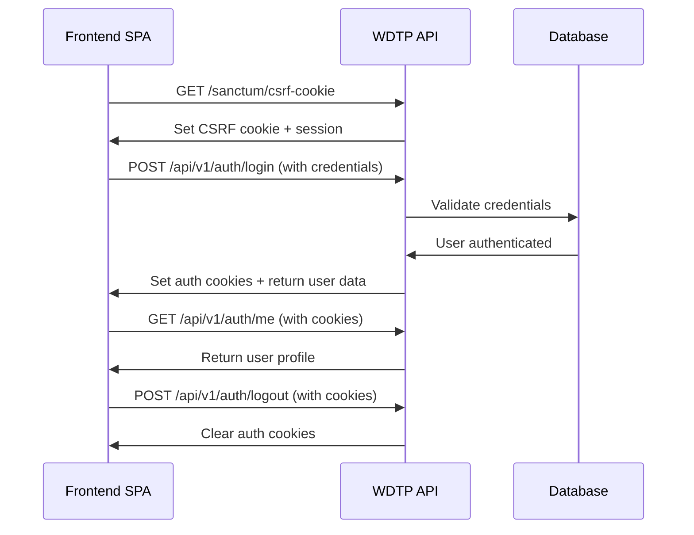

# SPA Authentication Guide - WDTP API

## Overview

This guide provides complete setup instructions for integrating Single Page Applications (SPAs) with the WDTP API using Laravel Sanctum's cookie-based authentication system. This approach provides secure, stateful authentication for web applications while maintaining the flexibility of token-based authentication for mobile and third-party integrations.

## Table of Contents

- [Architecture Overview](#architecture-overview)
- [CORS Configuration](#cors-configuration)
- [Environment Setup](#environment-setup)
- [Authentication Workflow](#authentication-workflow)
- [Frontend Integration](#frontend-integration)
- [Security Considerations](#security-considerations)
- [Troubleshooting](#troubleshooting)
- [Production Deployment](#production-deployment)

---

## Architecture Overview

### Authentication Methods Supported

**WDTP API supports two authentication methods:**

1. **Cookie-based Authentication (SPAs)**
   - Stateful authentication using encrypted cookies
   - CSRF protection enabled
   - Domain-restricted for security
   - Automatic session management

2. **Token-based Authentication (APIs)**
   - Bearer tokens for mobile apps and third-party integrations
   - Non-expiring personal access tokens
   - Stateless authentication
   - Cross-platform compatibility

### When to Use Each Method

| Use Case | Authentication Method | Benefits |
|----------|----------------------|----------|
| Web SPA (React, Vue, Angular) | Cookie-based | Better security, automatic CSRF protection, session management |
| Mobile Apps | Token-based | Cross-platform, offline support, simple integration |
| Third-party APIs | Token-based | Scalable, stateless, easy to manage |
| Server-to-server | Token-based | No session overhead, better performance |

---

## CORS Configuration

### Current CORS Settings

The API is configured to support SPA authentication with the following CORS policy:

```php
// config/cors.php
'paths' => ['api/*', 'sanctum/csrf-cookie'],

'allowed_origins' => [
    env('FRONTEND_URL'),              // Primary frontend URL
    'http://localhost:3000',          // Local development (React/Next.js)
    'http://localhost:3001',          // Alternative dev port
    'http://localhost:8080',          // Vue CLI default
    'http://127.0.0.1:3000',         // Alternative localhost
    // Additional local development URLs...
],

'supports_credentials' => true,       // Essential for cookie auth
```

### Key Configuration Details

**`supports_credentials: true`** is critical for SPA authentication because:
- Enables cookies to be sent with cross-origin requests
- Required for Sanctum's CSRF protection
- Allows automatic session management
- Without this, authentication cookies won't be transmitted

**Allowed Origins** must include:
- Your production frontend URL
- All development URLs you'll use locally
- Both `localhost` and `127.0.0.1` variants for compatibility

---

## Environment Setup

### Backend Configuration (.env)

```env
# Application URLs
APP_URL=http://localhost
FRONTEND_URL=http://localhost:3000

# Admin Bootstrap System
APP_SEED_ADMIN_EMAIL=admin@wdtp.local
APP_SEED_ADMIN_PASSWORD=your-secure-admin-password

# Database (External PostgreSQL + PostGIS)
DB_CONNECTION=pgsql
DB_HOST=your-postgres-host
DB_PORT=5432
DB_DATABASE=wdtp_production
DB_USERNAME=wdtp_user
DB_PASSWORD=your-secure-password

# Session Configuration (Important for SPA)
SESSION_DRIVER=database
SESSION_LIFETIME=120
SESSION_DOMAIN=localhost

# Sanctum Configuration
SANCTUM_STATEFUL_DOMAINS=localhost:3000,localhost:3001,localhost:8080
```

### Sanctum Stateful Domains

The `SANCTUM_STATEFUL_DOMAINS` environment variable defines which domains can use cookie-based authentication:

```env
# Local Development
SANCTUM_STATEFUL_DOMAINS=localhost:3000,localhost:3001,localhost:8080,127.0.0.1:3000

# Production
SANCTUM_STATEFUL_DOMAINS=yourapp.com,app.yourapp.com
```

### Frontend Environment Variables

```env
# React/Next.js example
REACT_APP_API_URL=http://localhost
REACT_APP_API_BASE_URL=http://localhost/api/v1

# Vue.js example
VUE_APP_API_URL=http://localhost
VUE_APP_API_BASE_URL=http://localhost/api/v1
```

---

## Authentication Workflow

### SPA Authentication Flow



### Step-by-Step Implementation

#### 1. Initialize CSRF Protection

Before making any authenticated requests, get a CSRF cookie:

```javascript
// Fetch CSRF cookie
await fetch('http://localhost/sanctum/csrf-cookie', {
  method: 'GET',
  credentials: 'include', // Critical: includes cookies
});
```

#### 2. Login with Credentials

```javascript
const loginResponse = await fetch('http://localhost/api/v1/auth/login', {
  method: 'POST',
  headers: {
    'Content-Type': 'application/json',
    'Accept': 'application/json',
  },
  credentials: 'include', // Critical: includes cookies
  body: JSON.stringify({
    email: 'user@example.com',
    password: 'password123',
    device_name: 'Web Browser'
  })
});

const loginData = await loginResponse.json();
console.log('User:', loginData.data.user);
// No need to store tokens - authentication is handled via cookies
```

#### 3. Make Authenticated Requests

```javascript
// All subsequent requests automatically include authentication cookies
const profileResponse = await fetch('http://localhost/api/v1/auth/me', {
  method: 'GET',
  headers: {
    'Accept': 'application/json',
  },
  credentials: 'include', // Always include this
});

const profile = await profileResponse.json();
```

#### 4. Logout

```javascript
await fetch('http://localhost/api/v1/auth/logout', {
  method: 'POST',
  headers: {
    'Accept': 'application/json',
  },
  credentials: 'include',
});

// Cookies are automatically cleared by the server
```

---

## Frontend Integration

### React/Next.js Integration

#### Authentication Hook

```javascript
// hooks/useAuth.js
import { createContext, useContext, useEffect, useState } from 'react';

const AuthContext = createContext();

export const AuthProvider = ({ children }) => {
  const [user, setUser] = useState(null);
  const [loading, setLoading] = useState(true);

  const apiRequest = async (url, options = {}) => {
    return await fetch(`http://localhost/api/v1${url}`, {
      ...options,
      headers: {
        'Accept': 'application/json',
        'Content-Type': 'application/json',
        ...options.headers,
      },
      credentials: 'include', // Always include cookies
    });
  };

  const getCsrfCookie = async () => {
    await fetch('http://localhost/sanctum/csrf-cookie', {
      credentials: 'include'
    });
  };

  const login = async (credentials) => {
    await getCsrfCookie();
    
    const response = await apiRequest('/auth/login', {
      method: 'POST',
      body: JSON.stringify(credentials)
    });

    if (response.ok) {
      const data = await response.json();
      setUser(data.data.user);
      return data;
    }

    throw new Error('Login failed');
  };

  const logout = async () => {
    await apiRequest('/auth/logout', { method: 'POST' });
    setUser(null);
  };

  const getUser = async () => {
    try {
      const response = await apiRequest('/auth/me');
      if (response.ok) {
        const data = await response.json();
        setUser(data.data.user);
      }
    } catch (error) {
      setUser(null);
    } finally {
      setLoading(false);
    }
  };

  useEffect(() => {
    getUser();
  }, []);

  return (
    <AuthContext.Provider value={{ user, login, logout, loading, apiRequest }}>
      {children}
    </AuthContext.Provider>
  );
};

export const useAuth = () => {
  const context = useContext(AuthContext);
  if (!context) {
    throw new Error('useAuth must be used within AuthProvider');
  }
  return context;
};
```

#### Login Component

```javascript
// components/Login.jsx
import { useState } from 'react';
import { useAuth } from '../hooks/useAuth';

const Login = () => {
  const { login } = useAuth();
  const [credentials, setCredentials] = useState({
    email: '',
    password: '',
    device_name: 'Web Browser'
  });

  const handleSubmit = async (e) => {
    e.preventDefault();
    try {
      await login(credentials);
    } catch (error) {
      console.error('Login failed:', error);
    }
  };

  return (
    <form onSubmit={handleSubmit}>
      <input
        type="email"
        value={credentials.email}
        onChange={(e) => setCredentials({...credentials, email: e.target.value})}
        placeholder="Email"
        required
      />
      <input
        type="password"
        value={credentials.password}
        onChange={(e) => setCredentials({...credentials, password: e.target.value})}
        placeholder="Password"
        required
      />
      <button type="submit">Login</button>
    </form>
  );
};
```

### Vue.js Integration

#### Authentication Plugin

```javascript
// plugins/auth.js
import { ref, reactive } from 'vue';

const user = ref(null);
const loading = ref(true);

const apiRequest = async (url, options = {}) => {
  return await fetch(`${process.env.VUE_APP_API_URL}/api/v1${url}`, {
    ...options,
    headers: {
      'Accept': 'application/json',
      'Content-Type': 'application/json',
      ...options.headers,
    },
    credentials: 'include',
  });
};

const getCsrfCookie = async () => {
  await fetch(`${process.env.VUE_APP_API_URL}/sanctum/csrf-cookie`, {
    credentials: 'include'
  });
};

export default {
  install(app) {
    const auth = reactive({
      user,
      loading,

      async login(credentials) {
        await getCsrfCookie();
        
        const response = await apiRequest('/auth/login', {
          method: 'POST',
          body: JSON.stringify(credentials)
        });

        if (response.ok) {
          const data = await response.json();
          user.value = data.data.user;
          return data;
        }

        throw new Error('Login failed');
      },

      async logout() {
        await apiRequest('/auth/logout', { method: 'POST' });
        user.value = null;
      },

      async getUser() {
        try {
          const response = await apiRequest('/auth/me');
          if (response.ok) {
            const data = await response.json();
            user.value = data.data.user;
          }
        } catch (error) {
          user.value = null;
        } finally {
          loading.value = false;
        }
      }
    });

    // Initialize authentication check
    auth.getUser();

    app.provide('auth', auth);
    app.config.globalProperties.$auth = auth;
  }
};
```

### API Request Examples

#### Submit Wage Report (Authenticated)

```javascript
const { apiRequest } = useAuth(); // React
// or
const auth = inject('auth'); // Vue

const submitWageReport = async (reportData) => {
  try {
    const response = await apiRequest('/wage-reports', {
      method: 'POST',
      body: JSON.stringify({
        wage_amount: 18.50,
        location_id: 1,
        position_category_id: 3,
        employment_type: 'full_time',
        ...reportData
      })
    });

    if (response.ok) {
      const data = await response.json();
      console.log('Report submitted:', data);
      // User earns XP points automatically
    }
  } catch (error) {
    console.error('Submission failed:', error);
  }
};
```

#### Geographic Search

```javascript
const searchWageReports = async (lat, lon, radius = 5) => {
  const response = await apiRequest(
    `/wage-reports?near=${lat},${lon}&radius_km=${radius}`
  );

  if (response.ok) {
    const data = await response.json();
    return data.data; // Array of wage reports with distance_meters
  }
};
```

---

## Security Considerations

### CORS Security

**Why `supports_credentials: true` is Secure:**
- Only allows cookies from explicitly whitelisted origins
- CSRF protection is automatically enforced
- Session cookies are encrypted and HTTP-only
- Domain restrictions prevent unauthorized access

**Production Security Checklist:**
- [ ] Use HTTPS in production (required for secure cookies)
- [ ] Whitelist only your production domains in CORS
- [ ] Set `SESSION_SECURE_COOKIE=true` in production
- [ ] Use environment-specific SANCTUM_STATEFUL_DOMAINS
- [ ] Implement proper error handling (don't expose sensitive data)

### Admin Bootstrap Security

**Environment Variable Security:**
- Store admin credentials in secure environment variable management
- Use strong, unique passwords (minimum 12 characters)
- Rotate admin passwords regularly
- Consider using separate admin email domain

**Production Deployment:**
```bash
# Create admin user on first deployment
./vendor/bin/sail artisan admin:ensure

# Verify admin user exists
./vendor/bin/sail artisan tinker
>>> App\Models\User::where('role', 'admin')->count()
```

### Session Security

**Recommended Production Settings:**
```env
SESSION_SECURE_COOKIE=true      # HTTPS only
SESSION_HTTP_ONLY=true          # Prevent XSS access
SESSION_SAME_SITE=lax          # CSRF protection
SANCTUM_STATEFUL_DOMAINS=yourdomain.com,app.yourdomain.com
```

---

## Troubleshooting

### Common Issues

#### 1. CORS Policy Errors

**Error**: `Access to fetch at 'http://localhost/api/v1/auth/login' from origin 'http://localhost:3000' has been blocked by CORS policy`

**Solution**:
```env
# Ensure your frontend URL is in CORS allowed origins
FRONTEND_URL=http://localhost:3000

# Check Laravel config cache
./vendor/bin/sail artisan config:clear
```

#### 2. CSRF Token Mismatch

**Error**: `419 Page Expired` or `CSRF token mismatch`

**Solution**:
```javascript
// Always fetch CSRF cookie first
await fetch('http://localhost/sanctum/csrf-cookie', {
  credentials: 'include'
});

// Then make your request
```

#### 3. Authentication Not Persisting

**Error**: User appears logged in but subsequent requests return 401

**Solutions**:
- Ensure `credentials: 'include'` on all requests
- Check `SANCTUM_STATEFUL_DOMAINS` includes your domain with port
- Verify session storage is working (database sessions recommended)

```bash
# Check session configuration
./vendor/bin/sail artisan config:show session

# Clear session data if needed
./vendor/bin/sail artisan session:flush
```

#### 4. Cookie Not Being Set

**Error**: Login successful but no authentication cookies

**Solutions**:
- Check browser developer tools for Set-Cookie headers
- Ensure domains match exactly (localhost vs 127.0.0.1)
- Verify CORS `supports_credentials: true`

```javascript
// Debug cookie setting
const response = await fetch('/api/v1/auth/login', {
  credentials: 'include'
});

// Check response headers
console.log(response.headers.get('set-cookie'));
```

### Debug Commands

```bash
# Check Sanctum configuration
./vendor/bin/sail artisan config:show sanctum

# Test CORS configuration  
curl -H "Origin: http://localhost:3000" \
     -H "Access-Control-Request-Method: POST" \
     -X OPTIONS http://localhost/api/v1/auth/login

# Check routes and middleware
./vendor/bin/sail artisan route:list --name=auth
```

---

## Production Deployment

### Environment Configuration

```env
# Production .env
APP_ENV=production
APP_DEBUG=false
APP_URL=https://api.yourdomain.com
FRONTEND_URL=https://app.yourdomain.com

# Admin Bootstrap
APP_SEED_ADMIN_EMAIL=admin@yourdomain.com
APP_SEED_ADMIN_PASSWORD=your-super-secure-production-password

# Session Security
SESSION_SECURE_COOKIE=true
SESSION_HTTP_ONLY=true
SESSION_SAME_SITE=lax
SESSION_DOMAIN=yourdomain.com

# Sanctum Production
SANCTUM_STATEFUL_DOMAINS=app.yourdomain.com,admin.yourdomain.com
```

### Deployment Checklist

#### Pre-deployment
- [ ] Update CORS origins for production domains
- [ ] Set secure admin credentials
- [ ] Configure HTTPS certificates
- [ ] Test authentication flow on staging

#### Deployment Steps
```bash
# 1. Deploy application code
git pull origin main

# 2. Install/update dependencies
composer install --optimize-autoloader --no-dev

# 3. Run migrations
php artisan migrate --force

# 4. Create admin user
php artisan admin:ensure

# 5. Clear and cache configuration
php artisan config:cache
php artisan route:cache
php artisan view:cache

# 6. Restart application server
```

#### Post-deployment Verification
```bash
# Test API health
curl https://api.yourdomain.com/api/v1/healthz

# Test admin login
curl -X POST https://api.yourdomain.com/api/v1/auth/login \
  -H "Content-Type: application/json" \
  -d '{"email":"admin@yourdomain.com","password":"your-password","device_name":"Test"}'

# Verify CORS
curl -H "Origin: https://app.yourdomain.com" \
     -H "Access-Control-Request-Method: POST" \
     -X OPTIONS https://api.yourdomain.com/api/v1/auth/login
```

### SSL/TLS Requirements

**HTTPS is Required** for production SPA authentication because:
- Secure cookies require HTTPS
- CSRF protection works best with HTTPS  
- Session security depends on encrypted connections
- Browser security policies enforce HTTPS for credentials

### Monitoring and Maintenance

**Log Monitoring**:
- Monitor authentication failures
- Track CORS policy violations
- Watch for CSRF token mismatches
- Alert on admin account access

**Regular Maintenance**:
- Rotate admin credentials quarterly
- Review and update CORS origins
- Monitor session storage usage
- Update Sanctum configuration as needed

---

## Additional Resources

- [Laravel Sanctum Documentation](https://laravel.com/docs/11.x/sanctum)
- [CORS Configuration Guide](https://laravel.com/docs/11.x/routing#cors)
- [WDTP API Documentation](../README.md)
- [Security Best Practices](https://laravel.com/docs/11.x/security)

---

**Built for secure, scalable SPA authentication with WDTP API** ✨